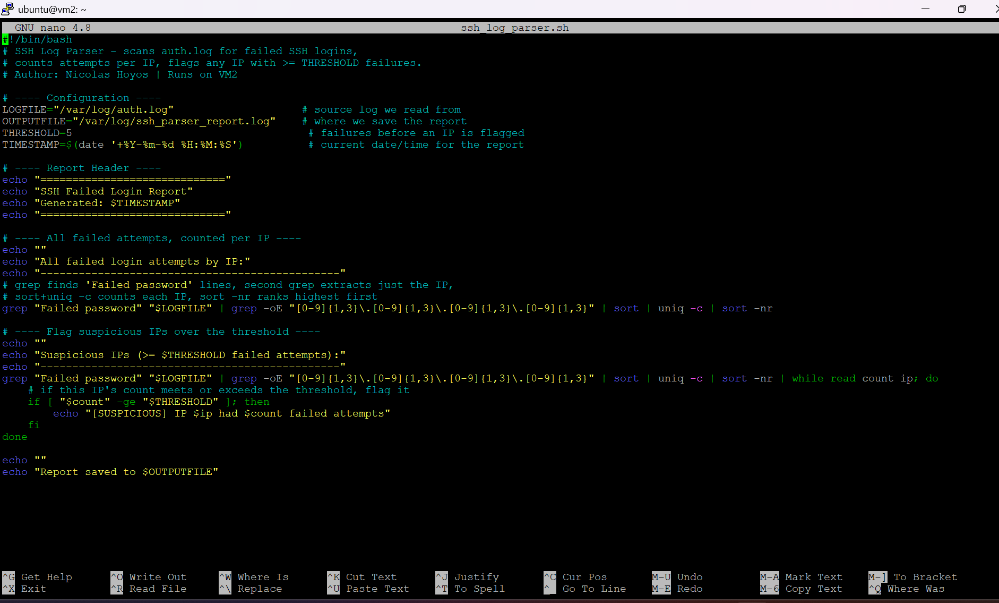
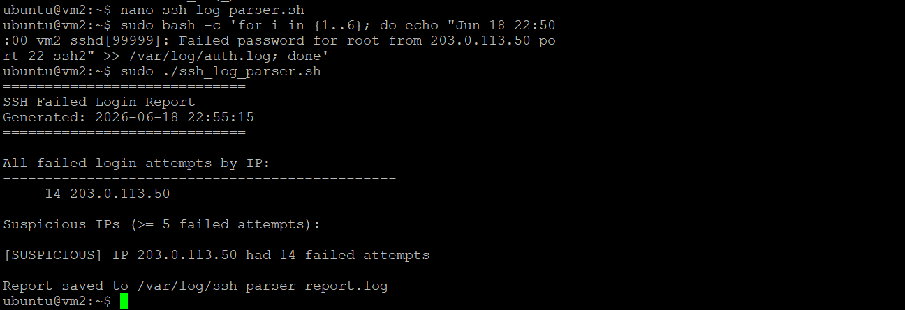

# Project 1 — SSH Log Parser (Bash, VM2)

## Purpose

This script scans the Linux authentication log for failed SSH login attempts, counts how many times each IP address fails, and flags any IP that meets or exceeds a threshold of five failures as suspicious. Early detection of brute-force attempts against login services is a core security monitoring task, protecting the infrastructure that runs trading and risk systems.

## Why it matters in production

Public-facing and internal SSH endpoints are constantly probed. A spike of failed logins from one IP is the signature of a brute-force or password-spray attack. In a financial services environment, catching that pattern early, before an attacker guesses a weak credential, is the difference between a logged non-event and a breach. This script turns a noisy log into a short, ranked list of who is knocking and who is knocking too hard.

## The script

```bash
#!/bin/bash
# SSH Log Parser - scans auth.log for failed SSH logins,
# counts attempts per IP, flags any IP with >= THRESHOLD failures.
# Author: Nicolas Hoyos | Runs on VM2

LOGFILE="/var/log/auth.log"                    # source log we read from
OUTPUTFILE="/var/log/ssh_parser_report.log"    # where we save the report
THRESHOLD=5                                     # failures before an IP is flagged
TIMESTAMP=$(date '+%Y-%m-%d %H:%M:%S')          # current date/time for the report

echo "============================="
echo "SSH Failed Login Report"
echo "Generated: $TIMESTAMP"
echo "============================="
echo "All failed login attempts by IP:"
grep "Failed password" "$LOGFILE" | grep -oE "[0-9]{1,3}\.[0-9]{1,3}\.[0-9]{1,3}\.[0-9]{1,3}" | sort | uniq -c | sort -nr
echo "Suspicious IPs (>= $THRESHOLD failed attempts):"
grep "Failed password" "$LOGFILE" | grep -oE "[0-9]{1,3}\.[0-9]{1,3}\.[0-9]{1,3}\.[0-9]{1,3}" | sort | uniq -c | sort -nr | while read count ip; do
    if [ "$count" -ge "$THRESHOLD" ]; then
        echo "[SUSPICIOUS] IP $ip had $count failed attempts"
    fi
done
```

## How to run

```bash
chmod +x ssh_log_parser.sh
sudo ./ssh_log_parser.sh
```

Reading `/var/log/auth.log` requires root, so run it with sudo.

## Proof





## How it works

The script uses grep to isolate only the lines containing Failed password, then a second grep with a regular expression extracts just the IP addresses. The sort command groups identical IPs together, uniq counts how many times each appears, and a final sort ranks them highest first. A while loop reads each IP and its count, and an if statement compares the count to the threshold of five. Any IP at or above five is flagged as suspicious. Because the lab network was quiet, the detection logic was validated by injecting simulated failed login entries for the documentation IP 203.0.113.50, which the script correctly flagged.

## Interview talking point

My SSH log parser reads from the authentication log, isolates failed password lines with grep, extracts the IPs with a regular expression, then counts attempts per IP using sort and uniq. A while loop checks each count against a threshold of five and flags anything at or above it as suspicious. I validated it by injecting simulated brute-force entries into the log and confirming the offending IP was flagged.
