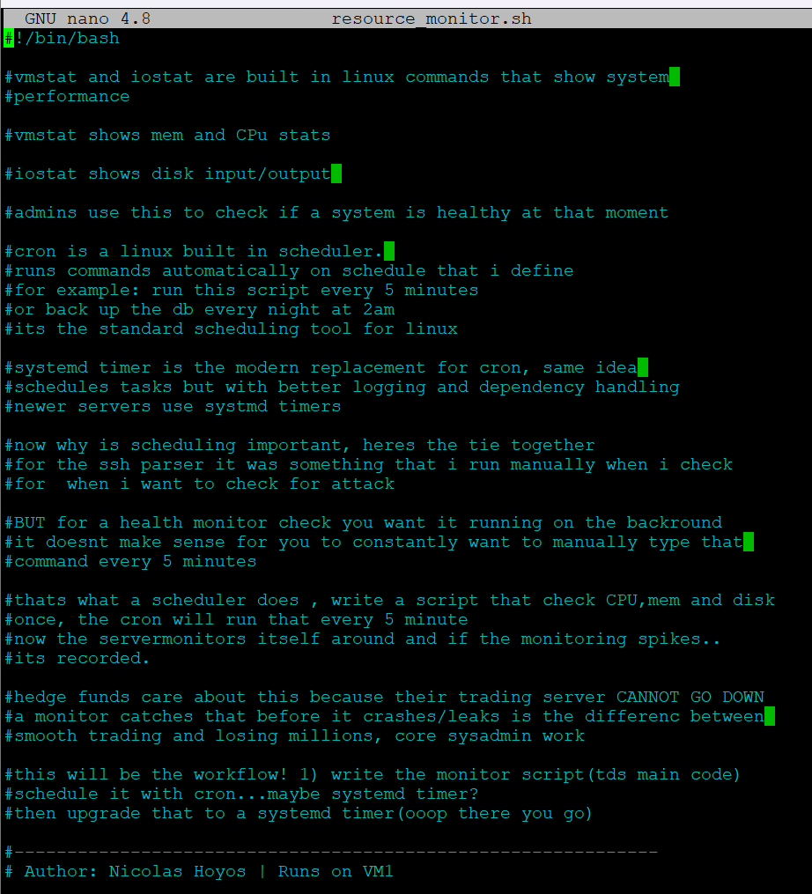
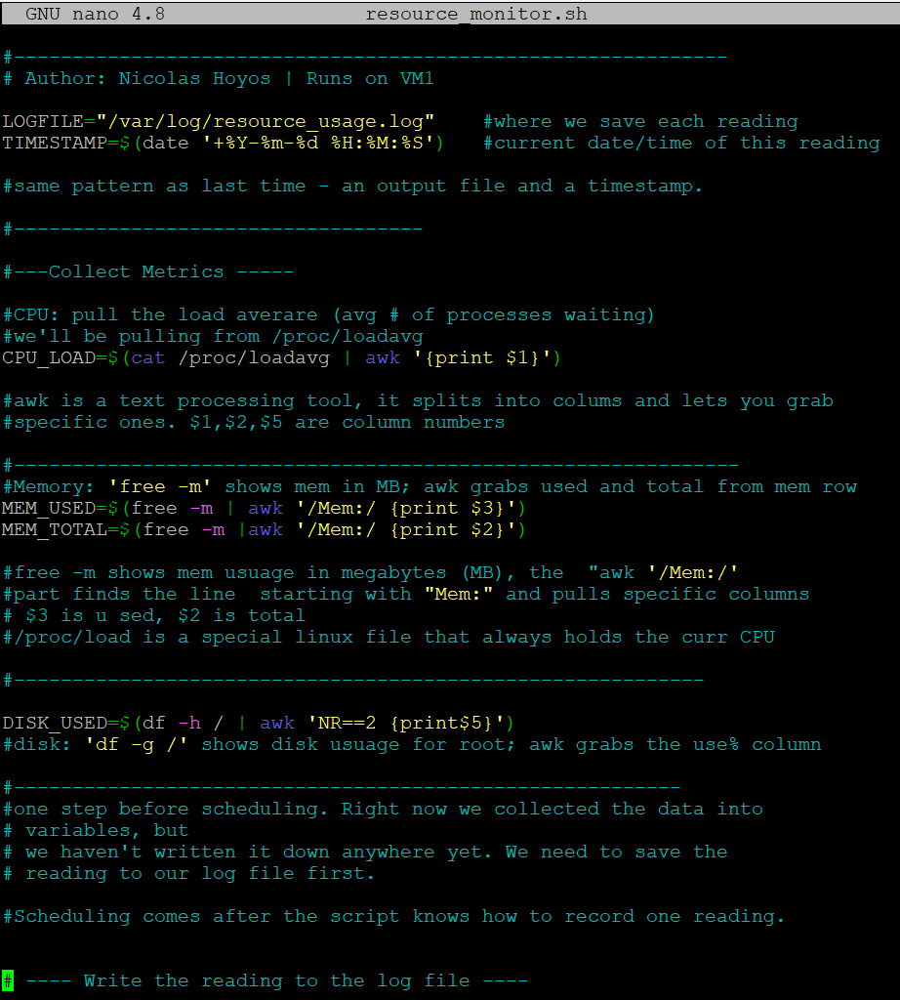
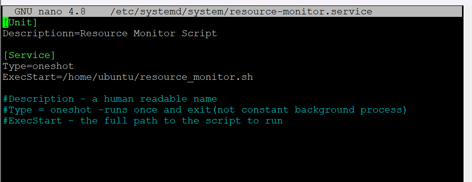
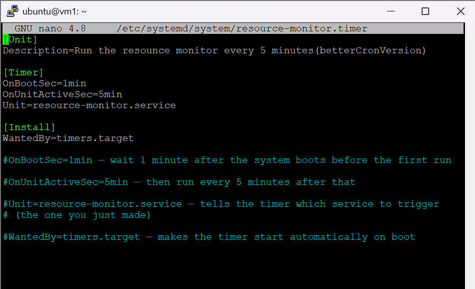
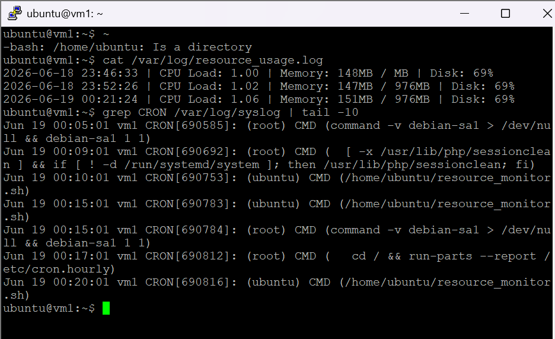
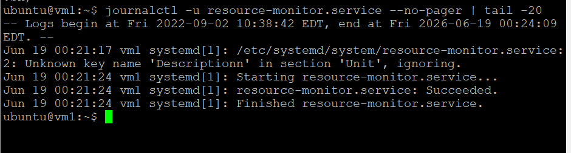
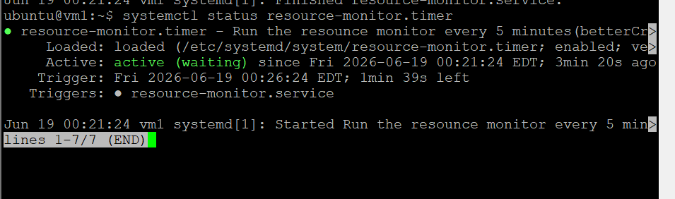
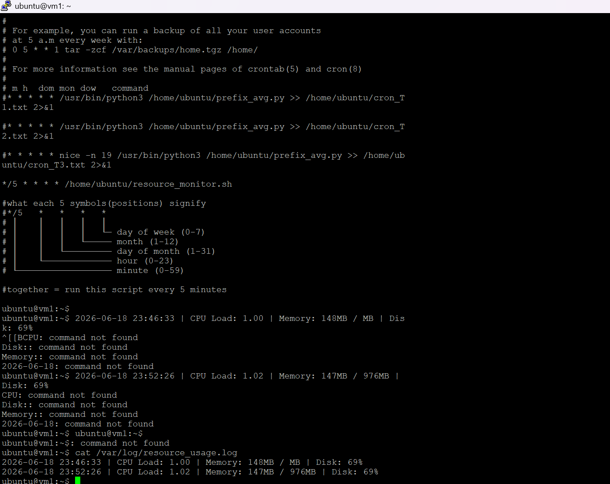

# Project 2 — System Resource Monitor with Cron and systemd (Bash, VM1)

## Purpose

This script logs CPU load, memory usage, and disk usage to a timestamped log file. It was first scheduled with cron to run every five minutes, then migrated to a modern systemd service and timer. Continuous automated monitoring of server health matters because trading systems cannot go down. Catching a memory leak or a filling disk before it crashes the system is the difference between smooth operation and major losses.

## Why it matters in production

Always-on systems fail in slow, predictable ways before they fail suddenly: a disk creeps toward full, memory leaks upward, load climbs. A lightweight monitor that records these numbers on a schedule gives you the history to spot the trend and act before an outage. Showing both the cron approach and the systemd timer approach also demonstrates the move from the older scheduler to the modern one, which gives better logging and reliability through the journal.

## The script

```bash
#!/bin/bash
# Resource Monitor - logs CPU, memory, and disk usage with a timestamp.
# Author: Nicolas Hoyos | Runs on VM1

LOGFILE="/var/log/resource_usage.log"
TIMESTAMP=$(date '+%Y-%m-%d %H:%M:%S')
CPU_LOAD=$(cat /proc/loadavg | awk '{print $1}')
MEM_USED=$(free -m | awk '/Mem:/ {print $3}')
MEM_TOTAL=$(free -m | awk '/Mem:/ {print $2}')
DISK_USED=$(df -h / | awk 'NR==2 {print $5}')

echo "$TIMESTAMP | CPU Load: $CPU_LOAD | Memory: ${MEM_USED}MB / ${MEM_TOTAL}MB | Disk: $DISK_USED" >> "$LOGFILE"
```

## Scheduling

First with cron, every five minutes:

```cron
*/5 * * * * /home/ubuntu/resource_monitor.sh
```

Then migrated to a paired systemd service and timer (`resource-monitor.service` and `resource-monitor.timer` in this folder). The service defines what to run, the timer defines when:

```ini
# resource-monitor.service
[Unit]
Description=Resource Monitor Script

[Service]
Type=oneshot
ExecStart=/home/ubuntu/resource_monitor.sh
```

```ini
# resource-monitor.timer
[Unit]
Description=Run the resource monitor every 5 minutes

[Timer]
OnBootSec=1min
OnUnitActiveSec=5min
Unit=resource-monitor.service

[Install]
WantedBy=timers.target
```

## How to run

```bash
chmod +x resource_monitor.sh
# cron: add the line above with `crontab -e`
# systemd: copy the unit files, then:
sudo systemctl daemon-reload
sudo systemctl enable --now resource-monitor.timer
systemctl list-timers
```

## Proof

















## How it works

The script reads CPU load from the special file `/proc/loadavg`, memory usage from the free command, and disk usage from the df command, using awk to extract the specific values. It appends one timestamped line to the log each time it runs. It was first automated with cron at a five-minute interval, then upgraded to a systemd timer for better logging and reliability. The systemd setup uses two paired files: a service unit that defines what to run, and a timer unit that defines when. The timer fires one minute after boot, then every five minutes after that.

## Interview talking point

I built a resource monitoring script that logs CPU load, memory, and disk usage to a timestamped file. I first scheduled it with cron at a five-minute interval, then migrated it to a systemd timer for better logging and reliability. The systemd setup uses a service unit that defines what to run and a timer unit that defines when. I verified both worked by checking syslog for cron execution and using systemctl list-timers and journalctl for the systemd timer.
