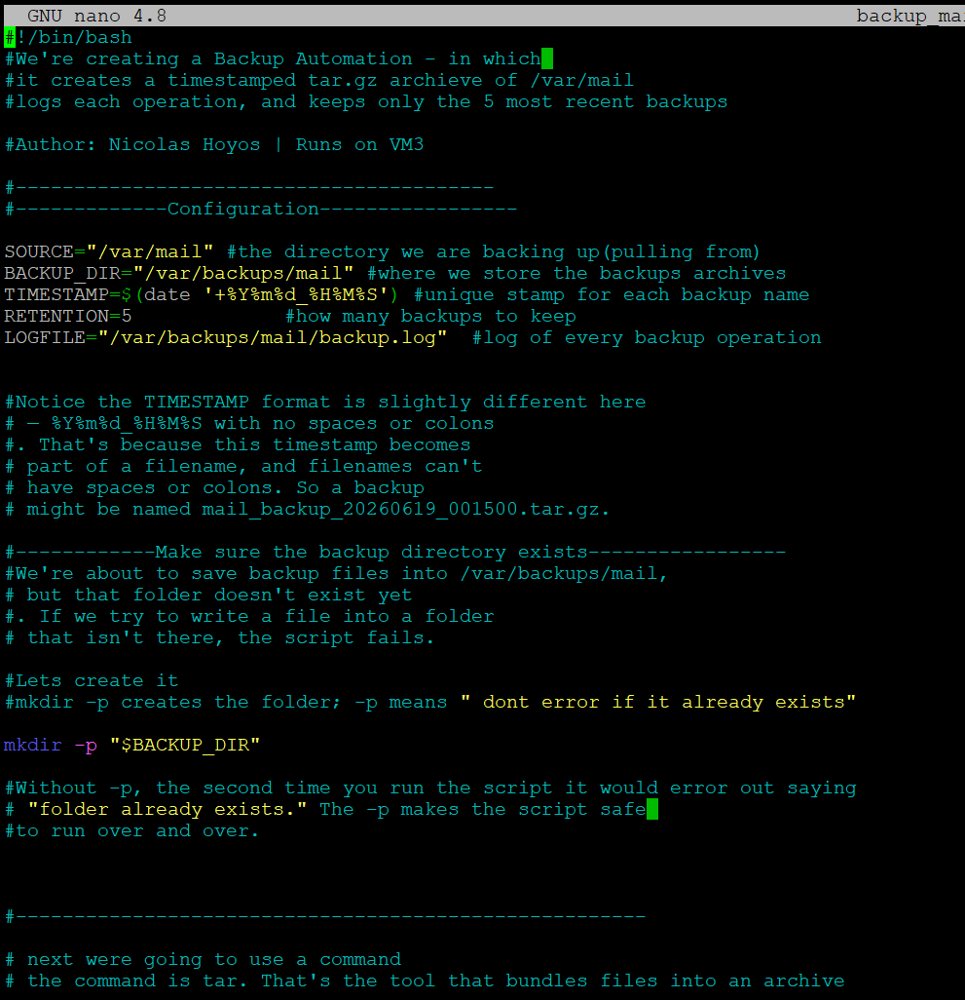
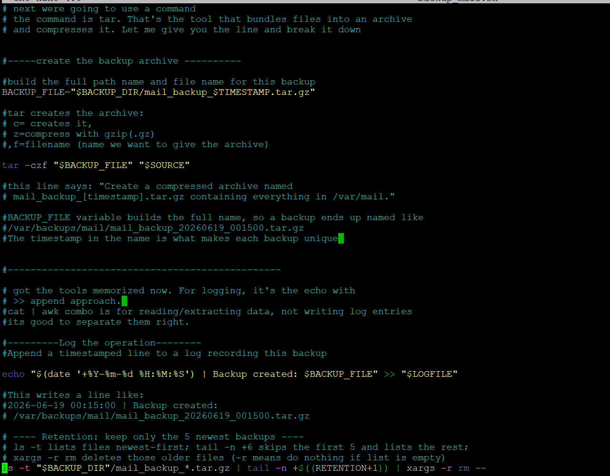
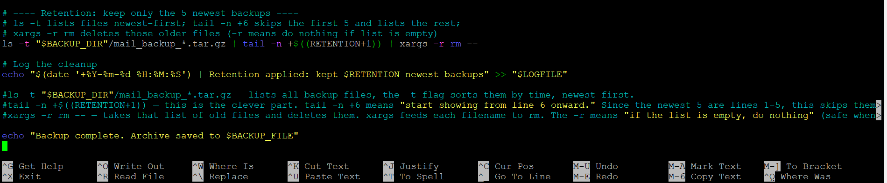
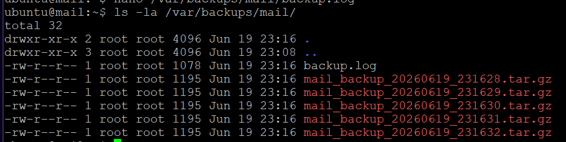
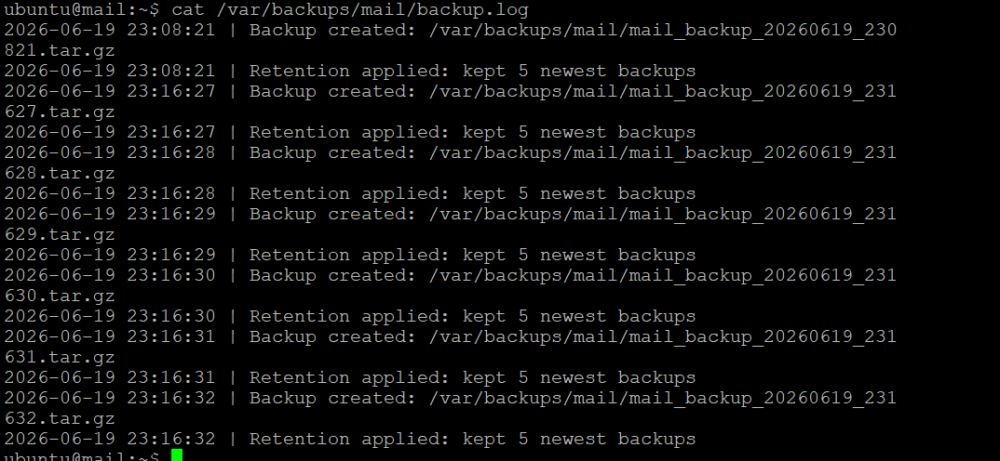

# Project 3 — Backup Automation (Bash, VM3)

## Purpose

This script creates a compressed, timestamped tar.gz archive of the mail directory, logs every operation to an audit file, and applies retention logic that keeps only the five newest backups while deleting older archives. Automated backups with retention protect critical data while preventing unbounded disk growth, and the audit log provides a clear record of every backup operation for compliance and troubleshooting.

## Why it matters in production

Backups without retention eventually fill the disk and cause the very outage they were meant to prevent. Backups without an audit trail leave you guessing whether last night's job actually ran. This script handles both: every run is timestamped and logged, and the retention logic guarantees a fixed footprint by keeping a known number of recent archives and pruning the rest. In a regulated environment, that audit log is also evidence that data protection is actually happening.

## The script

```bash
#!/bin/bash
# Backup Automation - timestamped tar.gz of /var/mail, logs operations,
# keeps only the 5 most recent backups. Author: Nicolas Hoyos | Runs on VM3

SOURCE="/var/mail"                              # directory we are backing up
BACKUP_DIR="/var/backups/mail"                  # where we store the archives
TIMESTAMP=$(date '+%Y%m%d_%H%M%S')              # unique stamp for each backup name
RETENTION=5                                     # how many backups to keep
LOGFILE="/var/backups/mail/backup.log"          # log of every operation

mkdir -p "$BACKUP_DIR"                          # create backup dir if missing
BACKUP_FILE="$BACKUP_DIR/mail_backup_$TIMESTAMP.tar.gz"
tar -czf "$BACKUP_FILE" "$SOURCE"               # c=create z=gzip f=filename
echo "$(date '+%Y-%m-%d %H:%M:%S') | Backup created: $BACKUP_FILE" >> "$LOGFILE"

# Retention: list newest-first, skip 5, delete the rest
ls -t "$BACKUP_DIR"/mail_backup_*.tar.gz | tail -n +$((RETENTION+1)) | xargs -r rm --
echo "$(date '+%Y-%m-%d %H:%M:%S') | Retention applied: kept $RETENTION newest backups" >> "$LOGFILE"
echo "Backup complete. Archive saved to $BACKUP_FILE"
```

## How to run

```bash
chmod +x backup_mail.sh
sudo ./backup_mail.sh
# schedule nightly with cron if desired, e.g. with `sudo crontab -e`:
# 0 2 * * * /home/ubuntu/backup_mail.sh
```

## Proof











## How it works

The script creates a compressed tar archive of the mail directory with a timestamp in the filename so every backup is uniquely named. It logs each operation to an audit file. The retention logic uses ls with the time flag to list backups newest first, tail to skip the five most recent, and xargs with rm to delete everything older. It was validated by running the script seven times and confirming exactly five backups remained, with the oldest two automatically removed.

## Interview talking point

My backup automation script creates a timestamped compressed archive of the mail directory and logs every operation to an audit file. The key piece is the retention logic: I list backups newest first, skip the five most recent, and delete the rest. I validated it by running the script seven times and confirming exactly five backups remained.
