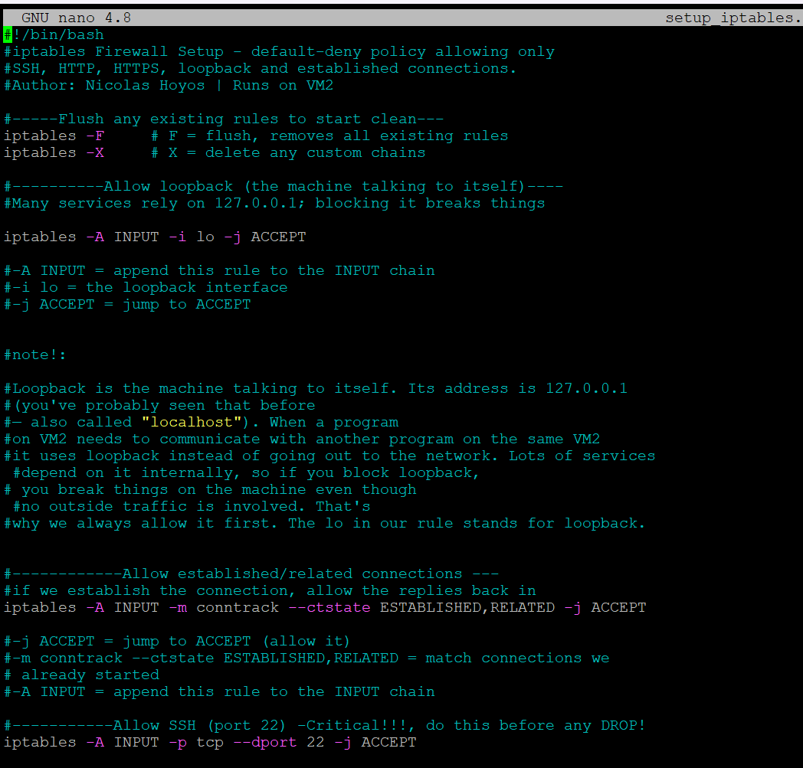
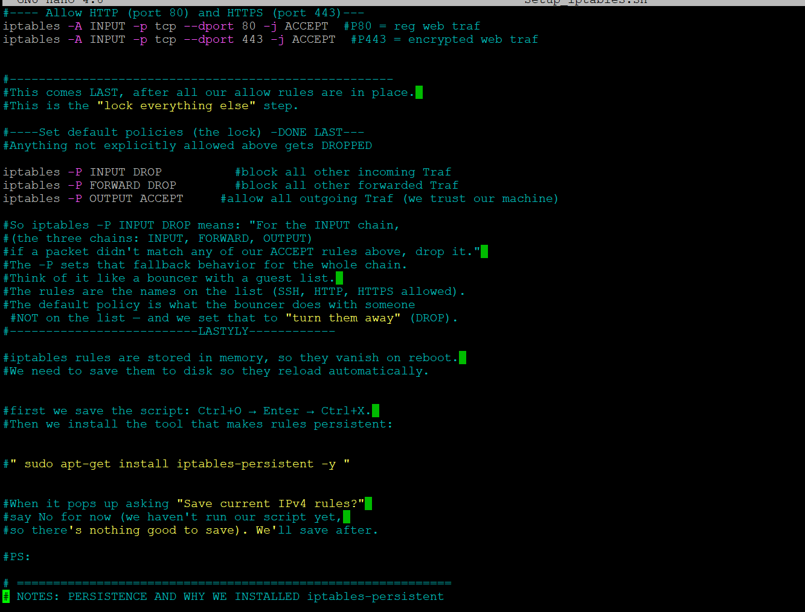
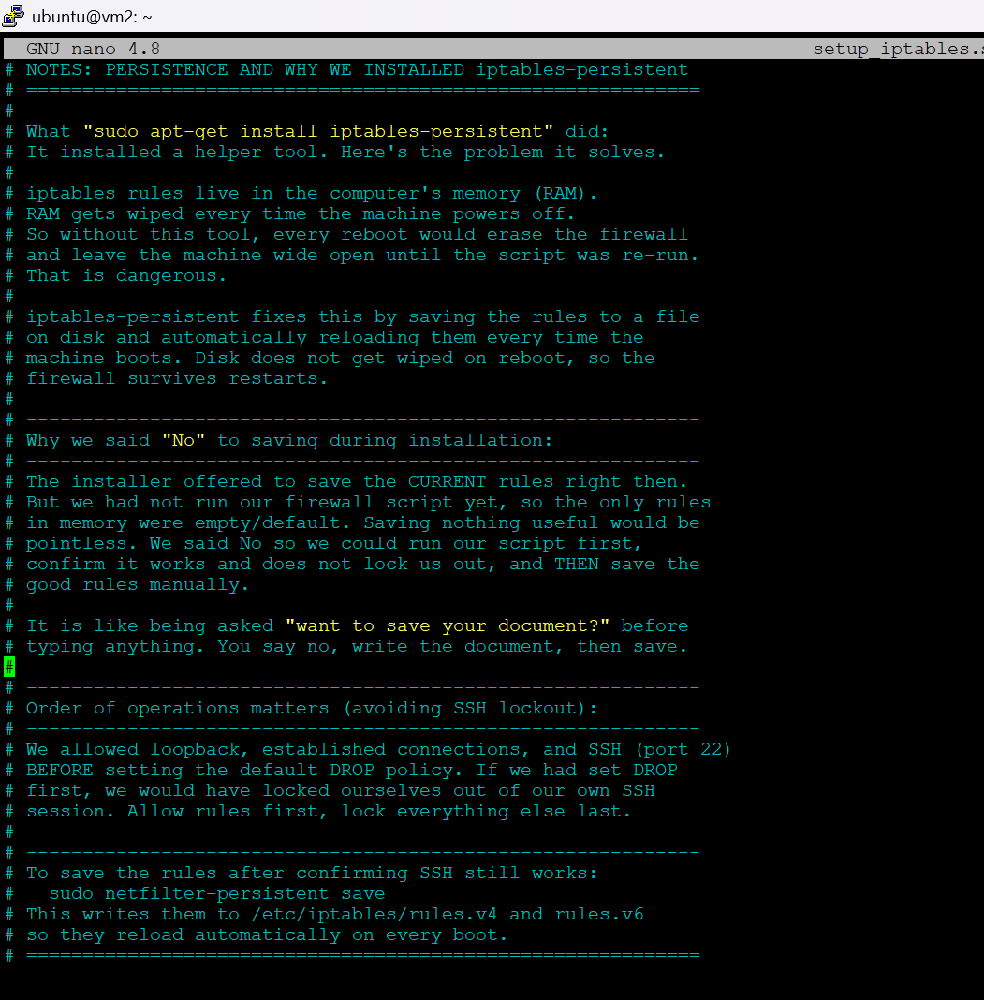
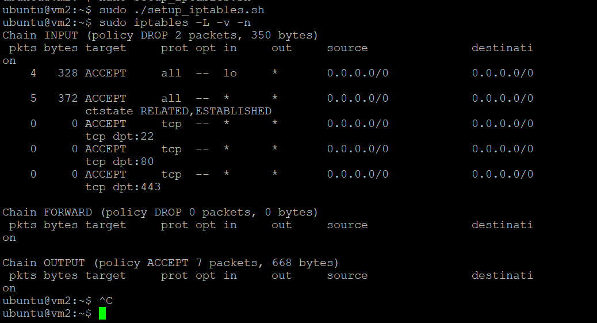
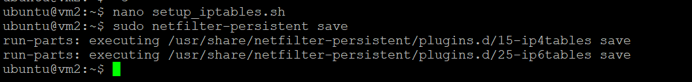

# Project 4 — iptables Firewall (VM2)

## Purpose

This script configures a default-deny firewall on VM2, allowing only SSH, HTTP, HTTPS, loopback, and established connections while dropping everything else. Rules are saved so they persist across reboots. Reducing the attack surface to only the ports actually needed is basic security hygiene that protects systems handling sensitive financial data, because every unnecessary open port is a potential entry point.

## Why it matters in production

A default-allow posture means every service, intended or forgotten, is reachable. A default-deny posture flips that: nothing is reachable unless you explicitly permit it, so a forgotten service or a newly opened port is closed until someone decides otherwise. The order of operations is the whole game here, and it doubles as the most important lesson in the project.

## Safe ordering to avoid SSH lockout

The critical principle is order of operations. The script allows loopback, established connections, and SSH on port 22 before setting the default drop policy. Setting drop first would have locked the administrator out of their own SSH session over the network. Allow rules come first, the lock comes last.

## The script

```bash
#!/bin/bash
# iptables Firewall Setup - default-deny policy allowing only
# SSH, HTTP, HTTPS, loopback, and established connections.
# Author: Nicolas Hoyos | Runs on VM2

iptables -F        # flush all existing rules
iptables -X        # delete any custom chains

iptables -A INPUT -i lo -j ACCEPT                                          # loopback
iptables -A INPUT -m conntrack --ctstate ESTABLISHED,RELATED -j ACCEPT     # replies
iptables -A INPUT -p tcp --dport 22 -j ACCEPT                              # SSH (do before DROP)
iptables -A INPUT -p tcp --dport 80 -j ACCEPT                              # HTTP
iptables -A INPUT -p tcp --dport 443 -j ACCEPT                             # HTTPS

iptables -P INPUT DROP        # block all other incoming
iptables -P FORWARD DROP      # block all other forwarded
iptables -P OUTPUT ACCEPT     # allow outgoing (we trust our machine)

# Save with: sudo netfilter-persistent save  (writes rules.v4 / rules.v6)
```

## How to run

```bash
chmod +x setup_iptables.sh
sudo ./setup_iptables.sh
sudo netfilter-persistent save   # persist the rules so they survive a reboot
sudo iptables -L -v -n           # verify the active ruleset
```

## Proof











## How it works

The script first flushes any existing rules for a clean start. It then allows loopback so the machine can talk to itself, allows established and related connections so replies to outgoing requests come back in, and allows SSH, HTTP, and HTTPS. Only after all allow rules are in place does it set the default policy to DROP for incoming and forwarded traffic, while leaving outgoing traffic accepted. Finally the rules are saved with netfilter-persistent so they survive reboots, since iptables rules otherwise live only in memory.

## Interview talking point

I built a default-deny firewall on VM2 using iptables. The key principle is order of operations: I allowed loopback, established connections, and SSH before setting the default drop policy, because setting drop first would lock you out of your own session. I then set INPUT and FORWARD to DROP so anything not explicitly permitted is blocked, and used netfilter-persistent to save the rules so they reload on boot.
