# Project 5 — LUKS Disk Encryption (VM3)

## Purpose

This project encrypts a storage volume on VM3 using LUKS, proves the data is unreadable when the volume is locked, and then sets up keyfile-based automatic unlock and mount through `/etc/crypttab` and `/etc/fstab`. Encryption of data at rest protects sensitive information even when a drive leaves the building: a decommissioned, lost, or stolen disk is useless without the key.

## Why it matters in production

Every other project here protects a running system. Disk encryption protects a different threat entirely. If someone pulls a drive out of a server and reads it on their own machine, a login password does nothing, because they are not logging in. LUKS scrambles the actual bytes on the disk, so the physical drive is just noise without the key. For a firm holding trading strategies, positions, and client financial data, encryption at rest is one of the most basic controls regulators expect.

## Mental model

The volume has one translating door. `/dev/mapper/secret_volume` is that door: it encrypts on the way in and decrypts on the way out, and you do all your work through it while it is open. `/dev/loop3` is the raw scrambled data sitting on the disk, permanently unreadable unless you go back in through the door. The filesystem and the files all live inside the encrypted container, so everything lands scrambled on the physical disk. That is why the filesystem is always built on the mapper, never on the raw device.

## Runbook

The full commented sequence is in [`setup_luks.sh`](setup_luks.sh). It is a runbook rather than a hands-off script, because a few steps prompt interactively for a passphrase. The stages are:

1. Create a 100 MB file with `dd` to act as a fake disk, so no real partition is at risk.
2. Attach it as a loop device with `losetup`.
3. Encrypt it with `cryptsetup luksFormat` (LUKS2, aes-xts-plain64, argon2i).
4. Open it with the passphrase, exposing `/dev/mapper/secret_volume`.
5. Build an ext4 filesystem on the unlocked mapper device.
6. Mount it, write a test file, read it back.
7. Unmount, close, then confirm the raw file is scrambled garbage.
8. Create a random keyfile, lock it to root, and register it with `luksAddKey`.
9. Configure `/etc/crypttab` and `/etc/fstab` (see [`crypttab.example`](crypttab.example) and [`fstab.example`](fstab.example)).
10. Test the unlock-and-mount chain from the config files.

## Proof

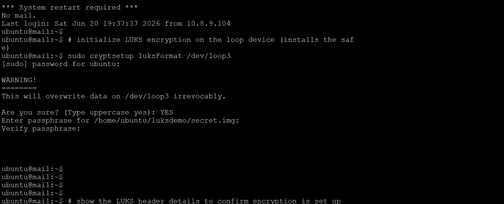

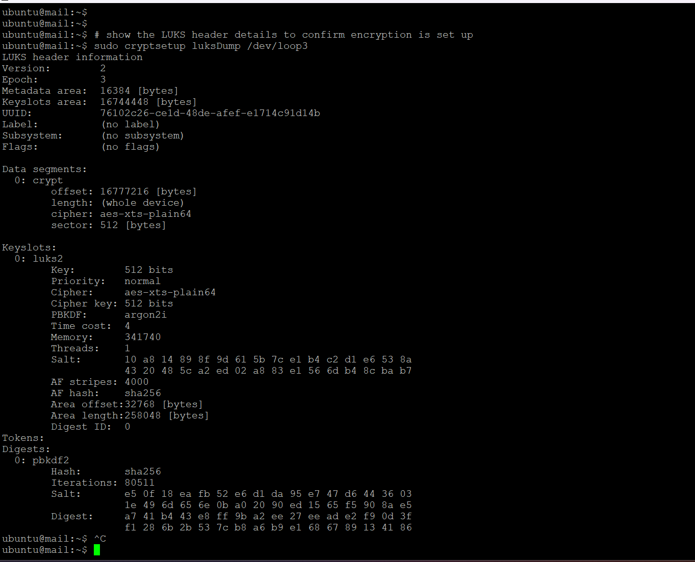

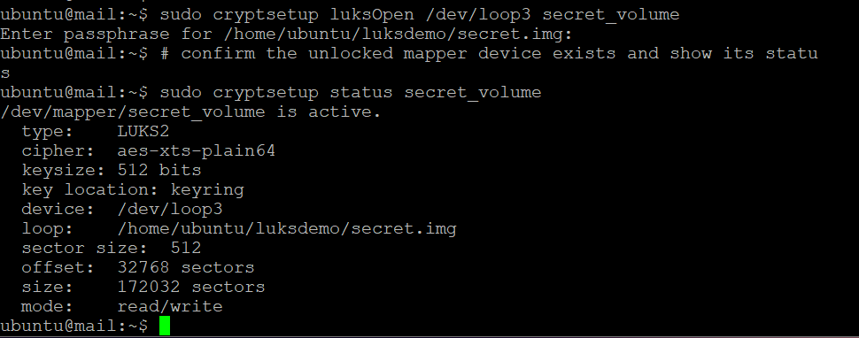

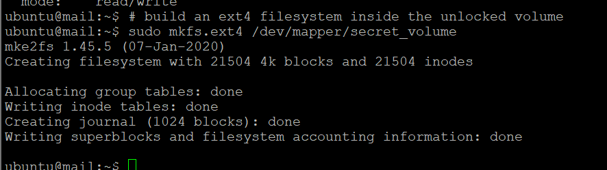

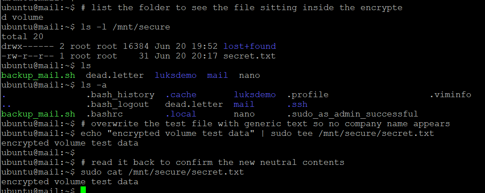

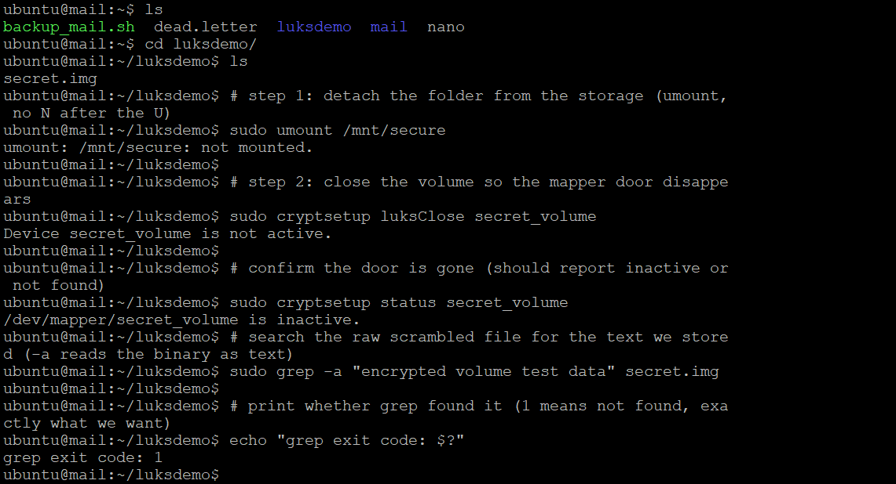

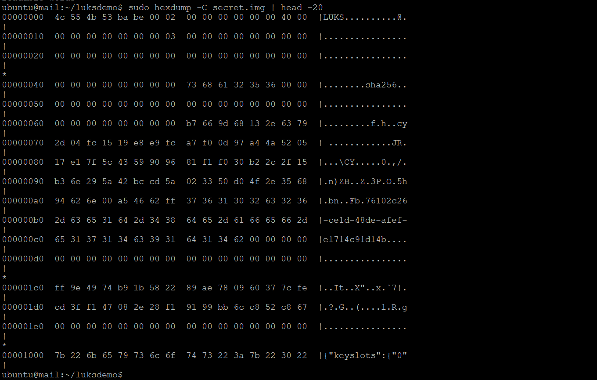

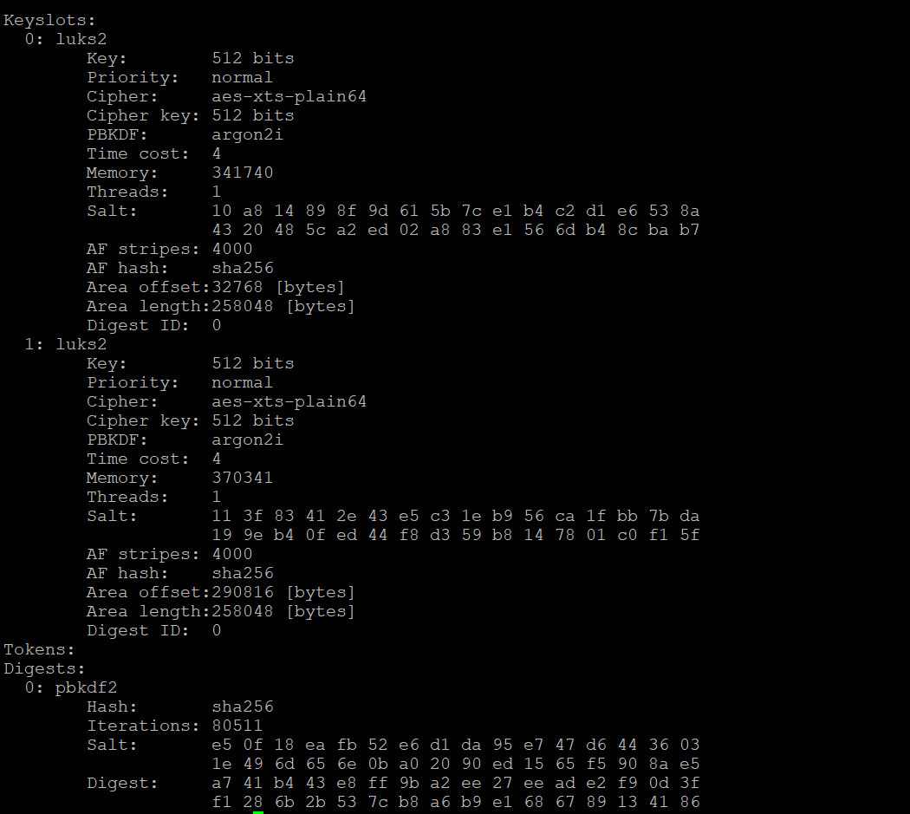

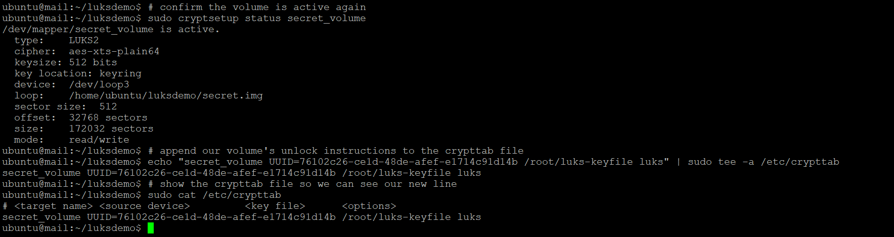

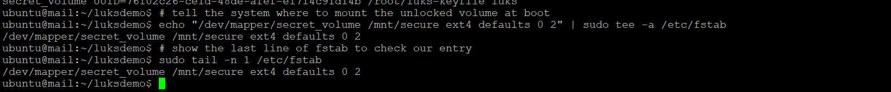

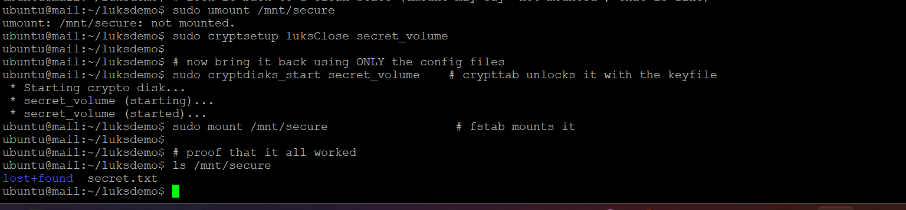

## The payoff

Screenshots 5 through 7 are the heart of the project. With the volume open, the test file reads back cleanly. After unmounting and closing it, the same raw file shows no plaintext at all (grep returns exit code 1) and a hexdump of pure scrambled bytes. Same file, but with the door shut it is unreadable. That contrast is the whole point of encryption at rest.

## How the automation works

A keyfile is a second key to the same volume, registered into its own key slot alongside the passphrase, which is why luksDump shows two slots. `/etc/crypttab` tells the system to unlock the volume with that keyfile, and `/etc/fstab` tells it to mount the result. Together they unlock and mount the volume without anyone typing a passphrase.

## Honest note on the loop-backed demo

Because this lab uses a loop file rather than a real partition, a true reboot would need the loop device recreated before crypttab could find it. On a real server you would back this with an actual partition, and then the boot-time unlock and mount happen fully on their own. The configuration and the keyfile flow shown here are identical either way.

## Security

The keyfile is created with `chmod 600` so only root can read it, and it is never committed to this repository (the `.gitignore` blocks it, along with the generated disk image). A keyfile that anyone can read defeats the encryption, so locking it down is part of the job, not an afterthought.

## Interview talking point

I set up LUKS encryption on a loop-backed volume, built an ext4 filesystem on the unlocked mapper device, and proved the data was unreadable once the volume was closed by showing the raw file as scrambled bytes. I then added a keyfile as a second key and configured crypttab and fstab so the volume unlocks and mounts on its own. I can also explain why the keyfile must be locked to root and never committed to a repository, and why you always work through the mapper device rather than the raw one.
